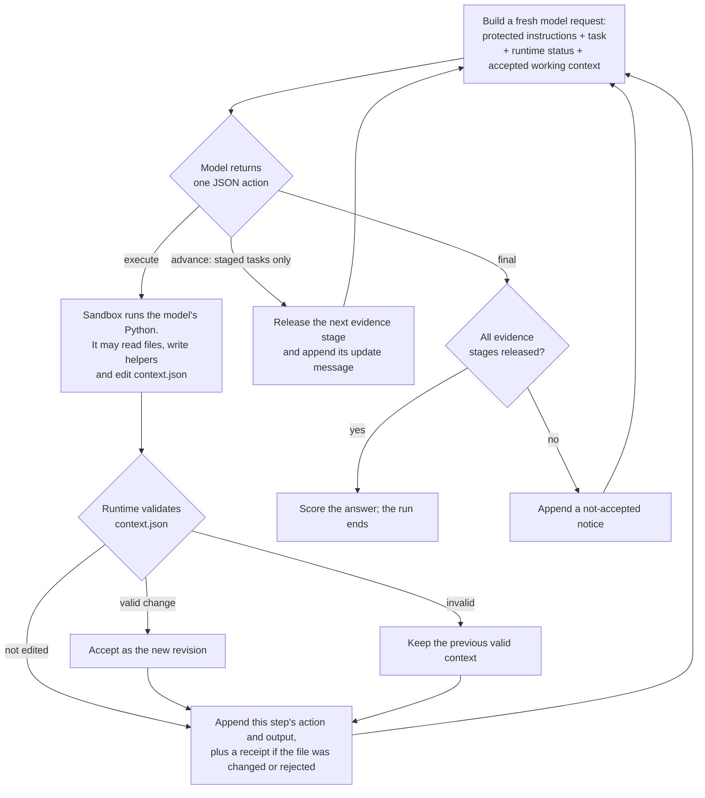

# clm-lib

A Python library for agents that edit their own working context and write their own context-management code, inspired by Context Language Models (CLMs).

Status: experimental (v0.1). Requirements: [SPEC.md](SPEC.md). Design and departures: [docs/architecture.md](docs/architecture.md). Measured results: [docs/results.md](docs/results.md) and the results repository, [armalite/clm-lib-test-results](https://github.com/armalite/clm-lib-test-results).

## How it works



- **Who does what.** The model decides what to keep, remove or rewrite, and writes the code that does it. The runtime provides the file, the sandboxed execution, the validation, and builds the next request from whatever was accepted. The task and instructions sit outside the file and can't be edited.
- **When edits take effect.** An edit made during step N first appears in the request for step N+1. That step's own action and output are appended after the edit.
- **Editing is optional.** Without an edit, the working context simply accumulates, step by step. Invalid edits are rejected and the previous valid state is kept.
- **Helpers are optional too.** The model may write reusable helper modules and call them in later steps, but editing `context.json` directly is just as much CLM.
- **The record is separate.** A complete trace (every request as sent, responses, accepted revisions with diffs, the model's code, and helper files before and after each step) is kept outside the editable context. Edits change what the model sees next, never the record.
- **No training.** This runs an existing model (`claude-opus-5-5`) through a runtime. It does not train or fine-tune a new model.
- **Staged tasks.** In staged incident tasks, evidence arrives in three stages. The `advance` action releases the next stage into the read-only task files. A `final` answer is accepted only once all stages are out. Single-stage incident tasks don't have `advance`.

Modes:
- **`summary` (baseline):** the same model, tools and limits, but no editable file. When a request reaches 70% of the budget, a separate model call summarises the older entries, and the summary replaces them. Two selectable policies (`[baseline] policy` in the config):
  - `fixed-tail/1` (default): the newest 4 entries are kept as they are, whatever their size.
  - `token-tail/1` (selected in `configs/exp003.toml`):
    - recent entries are kept up to a token allowance (15% of the budget), and the newest entry is kept if it fits 25%;
    - larger recent entries are summarised too;
    - summaries are sized so the request drops to about 50% of the budget, leaving room to keep working.
  Run it with, for example, `clm-lib --config configs/exp003.toml run --mode summary --task staged-dev-4`.
- **`clm` (evaluation):** the editable `context.json` described above, with ordinary capability instructions and pressure reminders. Editing is never required.
- **`guided` (demonstration only):** `clm` plus an explicit request to build a helper, use it in at least two steps and revise it if useful. This shows capability when prompted; it is not part of any comparison.

## Three kinds of evidence

| Kind | What it establishes | How |
| --- | --- | --- |
| **Pytests** | The implementation is correct: next-request replacement, the protected task, rejection of invalid edits, the sandbox boundary, accounting, staged evidence visibility, scoring, export. | `uv run pytest`. A scripted model drives the real sandbox; no API calls. |
| **Guided demonstration** | A real model *can* edit its context and build and reuse a helper when **explicitly asked to**. | `clm-lib guided`. Prompted, so it says nothing about spontaneous behaviour or benefit. |
| **Comparative evaluation** | Whether enabling CLM editing improves task outcomes or efficiency against the summary baseline. | `clm-lib compare` on frozen settings and evaluation instances never used for tuning. |

## Tasks and scoring

The incident tasks are synthetic production-incident investigations over local logs, configs, change records, metrics and notes, with deterministic ground truth that is never visible to the agent.
- **Single-stage incident tasks** (`dev`, `heldout-1..3`): all evidence is available from the start.
- **Staged incident tasks** (`staged-dev-*` for calibration, `staged-eval-*` for evaluation): evidence arrives in three stages, released when the agent sends an `advance` action. Later stages supersede earlier values and an earlier hypothesis, so useful facts have to survive while the investigation continues.

The answer has four fields: `root_cause`, `required_value`, `remedy` and `evidence_refs`. The scorer checks:
- the cause code and the remedy code;
- the exact current value. The superseded "stale" values are flagged as `stale_value`, and a superseded cause as `stale_hypothesis`.
- that the `path:line` references exist and cover every required evidence group: the symptom and the current-value record; staged tasks also need the origin record from stage 1.

**Strict success** requires all of them. The scorer does **not** judge explanation prose, and it does not check that the retained context was true; it only checks the final answer against ground truth. Scorer `score/2` also accepts answers written as `setting=value`; it was a post-hoc correction to `score/1`, and both versions are kept.

**Coding tasks with changing requirements** (`coding-dev-*`, `coding-eval-*`; `src/clm_lib/coding.py`):
- **The task:** the agent implements a small dependency-free package (`invoice`) in its workspace, starting from a skeleton.
- **Requirements** arrive in four stages via `advance`. Later documents list only the changes, marked NEW or CHANGED. CHANGED rules replace earlier versions; all other rules stay in force.
- **Visible tests:** a read-only `unittest` suite (`/task/fixtures/current-tests/`), rewritten at each stage to match the rules in force. The agent runs it from its own code inside the sandbox.
- **Finishing:** the agent submits with `{"action": "final", "answer": {"summary": "..."}}` once all stages are released.
- **Evaluation:**
  - After the run, a copy of the workspace is scored in a **fresh sandbox container** against evaluator-only checks. The checks are generated by a host-side reference implementation, on inputs different from the visible tests, and are never visible during the run.
  - Each check targets one rule and is tagged *retained* (an unchanged earlier rule; failures are regressions), *replaced* (a superseded rule; reproducing the old result counts as a stale rule) or *final_stage*.
  - **Strict success** means every check passes and the agent submitted.

**Coding tasks with interacting, partially changing rules** (`coding2-*` with 6 stages, `coding2h-*` with 8; `src/clm_lib/coding2.py`, generator `invoice-gen/2`, scorer `invoice-checks/2`):
- **Rules:** they interact (bulk lines and tier eligibility, discount-dependent and taxable shipping, coupon order, refunds), and a CHANGED rule may replace only part of an earlier rule.
- **Hidden checks:** they are tagged *retained*, *replaced* (with stale-rule detection), *kept_part*, *interaction* or *final_stage*, and may be flagged *boundary*. Return types are checked exactly.
- **Snapshots:** the workspace is snapshotted host-side at each `advance`, so a failed retained rule is called a regression only if it had passed its checks at an earlier stage.

**Multi-round incident** (`rounds-dev-*`, `rounds-eval-*`; `src/clm_lib/rounds.py`): 10–12 evidence rounds per instance. The answer lists incidents and unresolved follow-ups, scored by `rounds-score/1`. Modes `clm_direct` and `clm_helpers` give the same CLM capabilities, with reusable context-management helpers asked against or permitted; `helper_audit.py` classifies helper evidence.

**Request layouts and prompt caching** (`[request]` in the config; SPEC §17):
- **`single-user/1`** (the default) is the original layout.
- **`blocks/1`** sends text content blocks:
  - the stable task first, then one block per context entry, then the changing runtime status;
  - optionally, explicit 5-minute `cache_control` breakpoints on the task block and the last entry block;
  - optionally, a random per-run tag that keeps cache entries private to the run.
- **Per-run caching:** `run --caching on|off` sets caching for one run.

## Quickstart (offline, no API calls)

Prerequisites: Python 3.11+ with [uv](https://docs.astral.sh/uv/), and a running Docker daemon.

```bash
uv sync
docker pull python:3.12-slim
uv run clm-lib doctor --sandbox
uv run pytest
uv run clm-lib demo-offline
```

Library use:

```python
from pathlib import Path
from clm_lib import Config, DockerExecutor, Ledger, Runner, ScriptedProvider, generate

provider = ScriptedProvider(
    [
        {
            "action": "final",
            "answer": {
                "root_cause": "DB_POOL_EXHAUSTED: ...",
                "required_value": "12",
                "remedy": "RAISE_DB_POOL_LIMIT: ...",
                "evidence_refs": [],
            },
        }
    ]
)
runner = Runner(
    Config(),
    provider,
    DockerExecutor(),
    Ledger.open(Path("runs/l.json"), 0.0),
    price=None,
    live=False,
    runs_dir=Path("runs"),
)
result = runner.run(generate("dev"), mode="clm")
print(result.status, result.score.outcome, result.run_dir)
```

## Model access

One provider is implemented: the Anthropic Messages API, through the official `anthropic` SDK. Credentials are resolved by the SDK's own chain (`ANTHROPIC_API_KEY`, `ANTHROPIC_AUTH_TOKEN`, or an `ant auth login` profile). clm-lib never reads, prints or stores credential values; `doctor` reports only whether a source exists. `doctor --probe` makes one free models-endpoint call to verify access and the model ID.

Model, effort and limits are in [configs/default.toml](configs/default.toml), and dated prices in [configs/prices.toml](configs/prices.toml).

## Commands

Live commands are paid. Each call goes through a persistent ledger (`runs/ledger.json`, $10 ceiling by default) that reserves a conservative cost bound before dispatch. Run live commands **one at a time**.

| Command | Purpose |
| --- | --- |
| `clm-lib doctor [--probe] [--sandbox]` | Environment, credential presence, sandbox self-test |
| `clm-lib demo-offline` | Scripted-model mechanism demo through the real sandbox |
| `clm-lib smoke` | One minimal live call with structured-output and accounting checks |
| `clm-lib guided --task dev` | Prompted helper demonstration (not comparative) |
| `clm-lib run --mode summary\|clm\|guided --task NAME` | One live run (used for calibration) |
| `clm-lib compare ... --conditions summary:off,summary:on,clm:off,clm:on` | Four-condition comparison (approach × prompt caching) in Williams order; needs `request.layout = "blocks/1"` |
| `clm-lib compare --reps 2 [--tasks a,b,c] [--order pair\|balanced]` | Frozen comparison: tasks × 2 modes × reps. The mode order alternates per pair, or with `balanced`, across instances and across repetitions of each instance |
| `clm-lib report --out runs/report.md` | Markdown report from recorded evidence |
| `clm-lib export experiments/<id> --dest ../clm-lib-test-results` | Copy an experiment's evidence to the results repo |
| `clm-lib budget` | Show the ledger |
| `clm-lib --config <cfg> budget --set-ceiling X --reason "..."` | Explicitly change the stored ceiling (user-authorised; recorded in `ceiling_history`; never automatic) |

## Experimental results

Comparative experiments and their findings are published in [clm-lib-test-results](https://github.com/armalite/clm-lib-test-results), alongside protocols, settings and recorded evidence. These are exploratory synthetic evaluations, not a reproduction of the CLM paper's benchmarks.

## Where things live

| This repository (clm-lib) | [clm-lib-test-results](https://github.com/armalite/clm-lib-test-results) |
| --- | --- |
| Library code, tests, examples, evaluation tooling | Experiment write-ups, summaries, findings and the results index |
| Task generators, scorers and configs | Historical protocols, frozen configuration and source provenance |
| `experiments/<id>/experiment.json` (which runs make up an experiment) | Exported run artifacts, metrics, reports and manifests |
| The export utility, raw `runs/` and the active spend ledger | Ledger snapshots (historical copies) |

To publish a new experiment:
1. Add `experiments/<id>/experiment.json` listing its runs and roles.
2. Run `clm-lib export experiments/<id> --dest ../clm-lib-test-results`.
3. Write or edit `README.md`, `SUMMARY.md` and `protocol.md` **in the results repository**. The exporter creates starters if they are missing and never overwrites them.

The results repository's `EXPORT_FORMAT.md` describes the layout and checksum policy.

## Sandbox prerequisites

Generated code runs only via `docker run --rm` with:
- `--network none` and a non-root uid;
- `--cap-drop ALL` and `no-new-privileges`;
- memory, CPU and pid limits, and a read-only root filesystem with a `/tmp` tmpfs;
- a 30 s in-container timeout.

Fixtures are mounted read-only and the workspace read-write. The host environment, the Docker socket, credentials, traces and ground truth are never mounted. There is **no fallback** to unsandboxed execution.

## Layout

```text
src/clm_lib/
  context.py    entry schema, host-side revisions, validation, read-back
  runner.py     agent loop, modes, pressure/overflow handling, staged evidence, accounting
  provider.py   Anthropic adapter (stateless, SDK retries off) + scripted double
  executor.py   Docker sandbox + in-container execution evidence
  baseline.py   summary policy
  budget.py     dated prices, reservations, persistent ledger
  tracing.py    append-only events, saved requests, scripts, diffs, file snapshots
  tasks.py      single-stage incident fixtures + scorer
  staged.py     staged incident fixtures
  coding.py     coding task (changing requirements), reference model, sandboxed evaluator
  coding2.py    coding task with interacting, partially changing rules (invoice-gen/2) + evaluator
  rounds.py     multi-round incident task (incident-rounds-gen/1) + scorer
  helper_audit.py  helper-evidence tiers and direct-edit reuse findings
  invoice_ref2.py  standalone reference rules for invoice-gen/2
  prompts.py    frozen prompt text and request rendering
  report.py     markdown report from evidence
  export.py     results-repository export
  cli.py
experiments/<id>/   experiment selection only: experiment.json (run ids, roles, settings, provenance)
runs/               raw run artifacts and the active ledger (gitignored)
```

## Limitations

- Synthetic task families from deterministic generators; small pilots (2 repetitions per cell), with no statistical claims.
- The context budget applies to the whole request, using a calibrated chars-per-token estimate. Provider-reported tokens are recorded separately.
- Structural validation can't establish that retained claims are true.
- Edits and helpers live within one run; there is no cross-run skill learning and no training.
- Not a reproduction of the CLM paper's benchmark or harness. Original code; the reference implementation (CC BY-NC 4.0) was not copied.

## References

- Paper: https://arxiv.org/html/2609.37725v1
- Reference harness docs (pinned): https://github.com/facebookresearch/context-language-models/blob/18dc11115f50f261233c5bba7937834491e307e8/clm/clm_harness/README.md

License: Apache-2.0.
